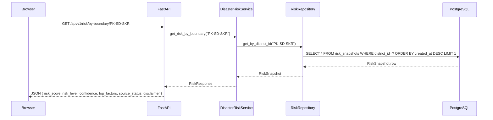
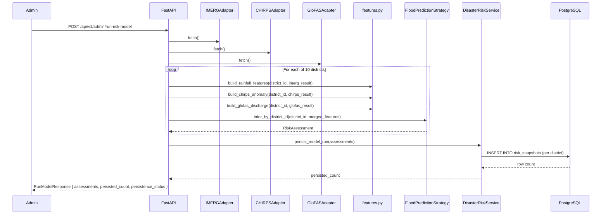
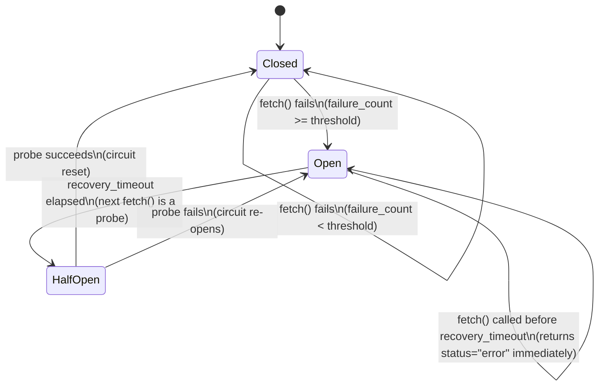

# Architecture Diagram — PakFlood AI

## Full System (Mermaid)

```mermaid
graph TB
    subgraph Frontend["Frontend — Next.js / Leaflet"]
        UI["Map UI\n(PakistanMap.tsx)"]
        Panel["RiskExplanationPanel"]
        Timeline["FloodTimeline"]
        Badge["SourceBadge"]
    end

    subgraph API["Backend API — FastAPI"]
        R_RISK["GET /risk/by-boundary/{id}"]
        R_EXPLAIN["GET /explain-risk/by-boundary/{id}"]
        R_ADMIN["POST /admin/run-risk-model"]
        R_STATUS["GET /admin/model-status"]
        R_SOURCES["GET /data-sources"]
        R_EVENTS["GET /flood-events"]
        R_ALERT["POST /alerts/generate-draft"]
    end

    subgraph Services["Service Layer — Facade"]
        DRS["DisasterRiskService\n(Facade)"]
        SRS["SourceRegistryService"]
    end

    subgraph Hazard["Hazard Layer — flood/"]
        STRATEGY["FloodPredictionStrategy\n(Strategy Pattern)"]
        FEATURES["features.py\nbuild_rainfall_features\nbuild_chirps_anomaly\nbuild_glofas_discharge"]
        EXPLAINER["FloodExplainer\n7-field explanations"]
        RULES["rules.py\nclassify_risk thresholds"]
    end

    subgraph Adapters["Adapters — Circuit Breaker"]
        IMERG["IMERGAdapter\nrainfall 1d/3d/7d"]
        CHIRPS["CHIRPSAdapter\nrainfall_anomaly_pct"]
        GLOFAS["GloFASAdapter\nriver_discharge_m3s"]
        FFD["FFDAdapter\nflood category"]
        RW["ReliefWebAdapter\narticles (live)"]
    end

    subgraph Repos["Repository Layer"]
        RISK_REPO["RiskRepository\ninsert_from_run\nget_by_district_id"]
        BOUNDARY_REPO["BoundaryRepository"]
        EVENT_REPO["FloodEventRepository"]
        ART_REPO["ArticleRepository"]
    end

    subgraph DB["Database — PostgreSQL + PostGIS"]
        DISTRICTS["districts"]
        SNAPSHOTS["risk_snapshots\n+ feature_snapshot_json\n+ source_status_json"]
        EVENTS_TBL["flood_events"]
        ARTICLES["articles"]
    end

    subgraph ML["ML Layer"]
        ARTIFACT["flood_baseline_v1.pkl\n(RandomForest)"]
        METRICS["metrics_report.json"]
        PIPELINE["feature_pipeline.py\ngenerate_dataset()"]
    end

    subgraph External["External Data Sources"]
        NASA["NASA IMERG\n(stub / GEE)"]
        CHIRPS_SRC["CHIRPS\n(stub / GEE)"]
        CDS["CDS / GloFAS\n(stub / API)"]
        PMD["PMD/FFD Bulletins\n(stub)"]
        RWEB["ReliefWeb REST API\n(live)"]
    end

    %% Frontend → API
    UI --> R_RISK
    UI --> R_EXPLAIN
    Panel --> R_EXPLAIN
    Badge --> R_SOURCES
    Timeline --> R_EVENTS

    %% API → Services
    R_RISK --> DRS
    R_EXPLAIN --> DRS
    R_ADMIN --> DRS
    R_SOURCES --> SRS
    R_EVENTS --> DRS
    R_ALERT --> DRS

    %% Services → Hazard
    DRS --> STRATEGY
    DRS --> EXPLAINER
    R_ADMIN --> FEATURES

    %% Hazard internal
    STRATEGY --> RULES
    STRATEGY --> ARTIFACT
    EXPLAINER --> RULES

    %% Admin → Adapters
    R_ADMIN --> IMERG
    R_ADMIN --> CHIRPS
    R_ADMIN --> GLOFAS

    %% Features → Feature builders
    FEATURES --> STRATEGY

    %% Adapters → External
    IMERG --> NASA
    CHIRPS --> CHIRPS_SRC
    GLOFAS --> CDS
    FFD --> PMD
    RW --> RWEB

    %% Services → Repos
    DRS --> RISK_REPO
    DRS --> BOUNDARY_REPO
    DRS --> EVENT_REPO
    DRS --> ART_REPO

    %% Repos → DB
    RISK_REPO --> SNAPSHOTS
    BOUNDARY_REPO --> DISTRICTS
    EVENT_REPO --> EVENTS_TBL
    ART_REPO --> ARTICLES

    %% ML
    PIPELINE --> ARTIFACT
    ARTIFACT --> STRATEGY
```

---

## Request Flow — GET /risk/by-boundary/{id}

---

## Request Flow — POST /admin/run-risk-model

---

## Circuit Breaker State Machine

---

## Design Patterns Summary

| Pattern | Implementation |
|---|---|
| **Strategy** | `FloodPredictionStrategy` — ML or rule-based inference |
| **Adapter** | `IMERGAdapter`, `CHIRPSAdapter`, `GloFASAdapter`, `FFDAdapter`, `ReliefWebAdapter` |
| **Circuit Breaker** | `BaseAdapter.fetch()` — fail-closed, recovery timeout, half-open probe |
| **Repository** | `RiskRepository`, `BoundaryRepository`, `FloodEventRepository`, `ArticleRepository` |
| **Facade** | `DisasterRiskService` — single orchestration point for all domain operations |
| **Factory** | `HazardModuleFactory` — returns hazard module by name |
| **Pipeline** | `feature_pipeline.generate_dataset()` — ingest → validate → features → labels |
| **Dependency Injection** | FastAPI `Depends()` — allows mock override in all tests without monkeypatching |
